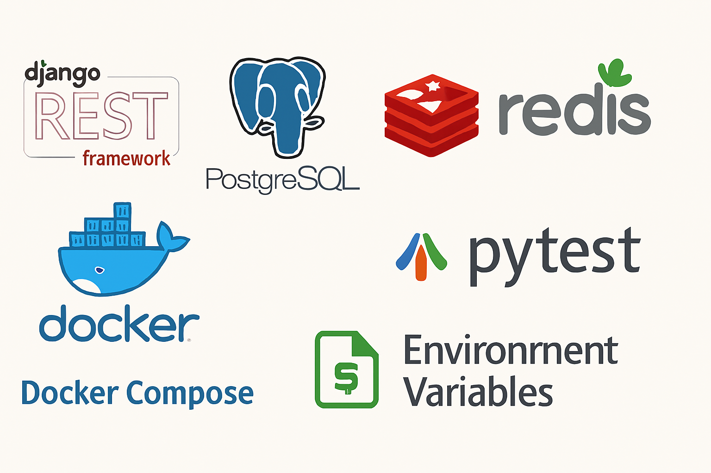

```markdown
# 🏨 Online Hotel Reservation (Backend)

A modern **backend-only hotel booking system** built with Django REST Framework and fully containerized for easy deployment.  
This project delivers a robust API architecture, background task processing, and scalable database management using modern technologies.



---


## 🚀 Tech Stack

- **Django** + **Django REST Framework** — RESTful API development  
- **PostgreSQL** — relational database  
- **Redis** — in-memory data store for caching and task brokering  
- **Celery** — asynchronous background task processing  
- **Docker** + **Docker Compose** — containerization & environment orchestration  
- **pytest** — automated testing and coverage reporting  
- **Environment Variables** — secure, flexible configuration

---

## 📌 Features

- Full CRUD API for **Hotels**, **Rooms**, and **Reservations**  
- **User authentication** (JWT or Session-based)  
- **Role-based access control** (Admin / Customer)  
- **Booking lifecycle management** with background processing:
  - Confirmation emails  
  - Expired booking cleanup  
- **Scalable multi-service architecture**:
  - Backend API  
  - Celery Worker  
  - Redis  
  - PostgreSQL  
- Comprehensive **pytest test suite** with fixtures and mocking  
- **Environment-based configuration** for development & production

---

## 📂 Project Structure

```
.
├── docker-compose.yml
├── backend/
│   ├── manage.py
│   ├── core/                 # Main project configuration
│   ├── apps/                 # Custom Django apps
│   │   ├── hotels/           # Hotel management
│   │   ├── bookings/         # Booking & reservation logic
│   │   ├── users/            # User management & authentication
│   │   └── ...
│   ├── media/                # Uploaded media files
│   ├── templates/            # Email & HTML templates
│   └── ...
├── celery/
│   └── tasks.py              # Celery task definitions
├── requirements.txt
├── pytest.ini
├── Dockerfile
├── .env                      # Local environment variables
├── .env-sample               # Example env file (copy to `.env`)
└── README.md
```

---

## ⚡ Quick Start

### Prerequisites

- **Docker** and **Docker Compose** installed

### Installation

1. **Clone the repository**
   ```bash
   git clone https://github.com/abbasalirezaei/Online-Hotel-Reservation.git
   cd Online-Hotel-Reservation
   ```

2. **Setup environment variables**
   ```bash
   cp .env-sample .env
   ```
   Then update `.env` with your local configuration.

3. **Start containers**
   ```bash
   docker-compose up --build
   ```

4. **Run database migrations**
   ```bash
   docker-compose exec django-backend python manage.py migrate
   ```

5. **Create a superuser**
   ```bash
   docker-compose exec django-backend python manage.py createsuperuser
   ```

6. **Access services**
   - Admin Panel → [http://localhost:8000/admin/](http://localhost:8000/admin/)
---

## 🧪 Running Tests

Run the entire test suite:
```bash
docker-compose exec django-backend pytest
```

Run a specific test module:
```bash
docker-compose exec django-backend pytest apps/bookings/tests/
```

---

## 🔧 Environment Variables

The project reads environment variables from the `.env` file.  
A sample configuration is available in `.env-sample`:

```
POSTGRES_DB=hotel_db
POSTGRES_USER=hotel_user
POSTGRES_PASSWORD=securepassword
REDIS_URL=redis://redis:6379/0
DJANGO_SECRET_KEY=your-secret-key
DJANGO_DEBUG=True
DJANGO_ALLOWED_HOSTS=localhost,127.0.0.1
```

---

## 🤝 Contributing

1. Fork the repository  
2. Create your feature branch (`git checkout -b feature/new-feature`)  
3. Commit your changes (`git commit -m 'Add some feature'`)  
4. Push to the branch (`git push origin feature/new-feature`)  
5. Open a Pull Request

---

## 📜 License

This project is licensed under the **GPL-3.0 License**.
```

---